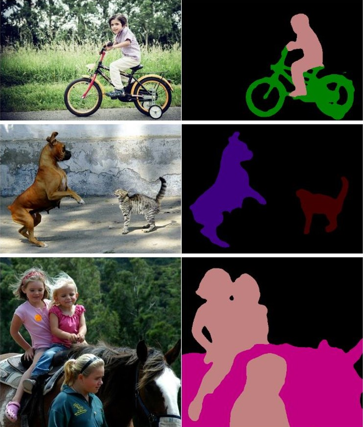

# TensorFlow Deeplabv3+ Segmentation of Pneumothorax disease in Android app
### Overview
Android Medical Diagnosis App Demo

### Details
This project was created using Google's deep learning [Deeplab](https://github.com/tensorflow/models/tree/master/research/deeplab) research model. DeepLab is a state-of-art deep learning model for semantic image segmentation, where the goal is to assign semantic labels (e.g., person, dog, cat and so on) to every pixel in the input image.

Expected result from deeplab model

After training with the provided [Kaggle dataset](https://www.kaggle.com/c/siim-acr-pneumothorax-segmentation) the outcome of the model is:

Training has been done to Google's Colaboratory with the provided MobilenetV2 backbone. Tensorflow was the framework that has been used. Due to some limitations it was not possible to convert the model to TF-Lite so Tensorflow 1.13.1 has been used for training and as a dependency inside android application.

There is an ImageView that overlaps a TextureView and loads the generated images from the Tensorflow inference. Inside the project there is also a part of the code that uses OpenCv to detect green blobs as they appear at the generated image. After detection you can make use of the OpenCv library to point or even replace the green blobs with something else as you can see at an android app that already uses this kind of inference in [Google Play](https://play.google.com/store/apps/details?id=com.george.soloupis_change_wheels).

